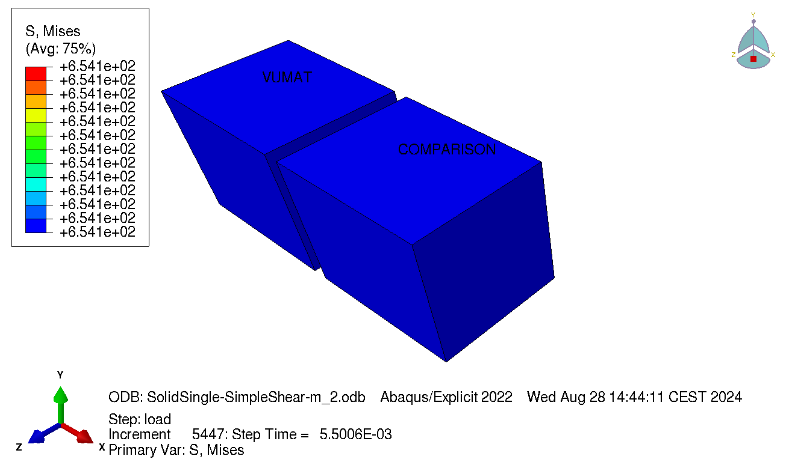

# VUMAT-Hershey-MJC
This project contains an Abaqus VUMAT subroutine for 3D continuum elements.
The implemented material model uses the Modified Johnson Cook (MJC) thermo-viscoplastic model and the Hershey yield surface. 
To perform the return mapping (update the stress, strain and internal variables), the cutting-plane method is used.

Part of the source files can be viewed in subroutine directory. For a complete version of the code, as well as a detailed report covering the theory, visit [caeassistant.com](https://caeassistant.com/).



# USAGE:

Below it is shown how to specify the material of the subroutine in the input file:

```
*Material, name=VUMAT
*density
7.0e-9
*user material, CONSTANTS=17
**      E,     nu,  sigma0,  Q1,   C1,     Q2,      C2,    Q3,
210000.0,    0.3,  290.7,   129.2, 168.6, 209.8,   10.68,  455.3,      
**       C3,   n (hershey),  cp,      betaTQ,  T0,      Tm,       m,    pdot0,
         0.805,  2.,            452e6,   0.9,     293.0,   1800.0,   1000.0,  5e-5,
**       c
         0.0
*depvar
2
**1, p, "Euivalent plastic strain" 
**2, T, "Temperature"
```

The various constants are breifly explained below, but it is adviced to read the corresponding report (at [caeassistant.com](https://caeassistant.com/)) for more detail.
- E - youngs modulus
- nu - poisson ratio
- sigma0 - initial yield stress
- Q1-Q3 and C1-C3 - Voce hardening parameters
- n - exponent of the Hershey yield surface n=1 corresponds to Tresca, n=2 correspons to Mises
- cp - Heat capacity
- betaTQ - Inelastic heat fraction, typically set to 0.9
- T0 - Initial temperature
- Tm - Melting temperature
- m - Exponent accounting for temperature softening. Setting m to a very high value (for instance 1000) effectively disables it. 
    m = 1 gives a linear dependence on temperature.
- pdot0 - Reference viscoplastic strain rate.
- c - Parameter which influences viscoplastic behaviour. Setting c=0 disables viscoplasticity.

In addition to an abaqus installation and license you need a specific fortran compiler to let abaqus compile the subroutine for you.
It can be downloaded freely from here: https://www.intel.com/content/www/us/en/developer/tools/oneapi/hpc-toolkit-download.html

To submit a job with the vumat, you can use the following command:

>abaqus job=inp-file user=path/to/vumat.f double int ask_delete=off

(The tree last options are optional)
